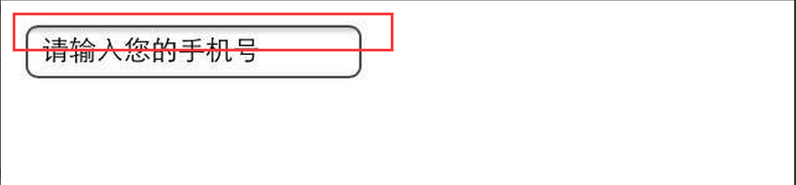

#粉爱红包总结

###1.背景

作为滴滴专车推广的一个活动手段，让专车更正派的能够运营，以关爱女性出行为主，进行推广

###2.开发阶段所遇到的问题与心得

### 一.布局方面：

* 背景支持等比缩放

###
	.bg {
        width: 100%;
        background: url("http://static.diditaxi.com.cn/activity/imgs-pinklove/mail_open.png") left top no-repeat;
        background-size: 100%;
        padding-top: 90%;
    }

	

* 去掉input框的背景 上面的阴影

###
 	-webkit-appearance:none;

* 小米手机input输入框，用type="tel"键盘能起来，但是 不聚焦，也输入不了

###
  	-webkit-user-select: text;
	//因为我在body{-webkit-user-select: text;}用了这个,禁止用户选择

* input框新增属性 [http://blog.csdn.net/lgd5979/article/details/7035042](http://blog.csdn.net/lgd5979/article/details/7035042)

####
	::-webkit-input-placeholder {
	     color: red;
	 }

* 微信分享动态绑定 及 判断是否在微信里面执行（即app，微信）

#### 

	function define_wx_share(WeixinJSBridge, obj) {

            WeixinJSBridge.call("showOptionMenu");
            WeixinJSBridge.call('hideToolbar');
            /**
             * 分享给好友
             * @param  {[type]} argv [description]
             * @return {[type]}      [description]
             */
            WeixinJSBridge.on('menu:share:appmessage', function(argv) {
                WeixinJSBridge.invoke('sendAppMessage', {
                    "appid": "wx69b6673576ec5a65",
                    "img_url": obj.img_url,
                    "link": obj.link,
                    "title": obj.sharetitle,
                    "desc": obj.sharedesc
                }, function(res) {});
            });

            /**
             * 分享到朋友圈
             * @param  {[type]} argv [description]
             * @return {[type]}      [description]
             */
            WeixinJSBridge.on('menu:share:timeline', function(argv) {
                WeixinJSBridge.invoke('shareTimeline', {
                    "img_url": obj.img_url,
                    "link": obj.link,
                    "title": obj.sharetitle,
                    "desc": obj.sharedesc
                }, function(res) {});
            });
        }

        var onBridgeReady = function(argument) {
            WeixinJSBridge.call('hideToolbar'); //隐藏底部工具栏
            WeixinJSBridge.call('hideOptionMenu'); //隐藏右上角分享按

            ajax({
                method: "GET",
                url: get_card_detail_info,
                succFunc: function(data) {

                    var da = txtToJson(data);
                    if (da.errno == 0) {
                        var sendDate = da.send;
                        if (isTake == 0) { //0：没领

                            headTxt.innerHTML = "领卡的人还没有出现哦~";
                            receiveImg.src = "http://static.diditaxi.com.cn/activity/imgs-pinklove/no_get.png";
                            receiveName.innerHTML = "？";
                            content.innerHTML = da.description + "送你一张滴滴专车券。";
                            sendName.innerHTML = nicknameFn(sendDate.nickname);
                            sendImg.src = sendDate.head_url;
                        } else if (isTake == 1) { //1: 领取   

                            var receive = da.get; //收到的
                            headTxt.innerHTML = nicknameFn(receive.nickname) + "领走了你的卡";
                            sendImg.src = sendDate.head_url;
                            sendName.innerHTML = nicknameFn(sendDate.nickname);
                            content.innerHTML = da.description + "送你一张滴滴专车券。";
                            receiveName.innerHTML = nicknameFn(receive.nickname);
                            receiveImg.src = receive.head_url;

                            common.show(btn);
                            var share_config = {
                                general_config: {
                                    img_url: sharePic, //小图的链接
                                    sharetitle: shareTitle,
                                    sharedesc: shareTxt,
                                    link: shareUrl //分享出去的链接地址
                                }
                            };

                            var obj = share_config.general_config;
                            //分享相关
                            define_wx_share(WeixinJSBridge, obj);
                        }
                    } else {
                        location.replace(load_error_page);
                    }
                },
                failFunc: function() {
                    location.replace(load_error_page);
                }
            });
        }

        if (typeof WeixinJSBridge === "undefined") {
            document.addEventListener('WeixinJSBridgeReady', onBridgeReady);
        } else {
            onBridgeReady();
        }
	

	

